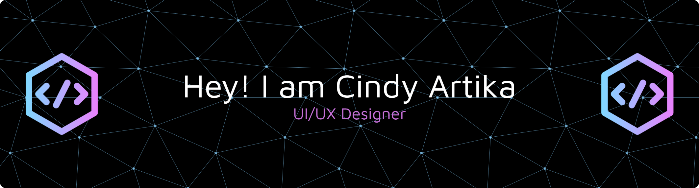

## Welcome to My GitHub Profile 👋

### 💫 About Me
I am a **Beginner Programmer** and an undergraduate student at  
**University of North Sumatra (USU)** majoring in **Information Technology**.

I am passionate about web development and continuously improving  
my skills in programming and technology 🚀

---

### 🌐 Connect With Me

---

### 💻 Tech Stack

#### 👩‍💻 Programming Languages

#### 🌐 Frontend

#### ⚙️ Framework

#### 🎨 Design Tools

---

<picture>
  <source media="(prefers-color-scheme: dark)" 
    srcset="https://raw.githubusercontent.com/CindyArtika/CindyArtika/output/pacman-contribution-graph-dark.svg">
  <source media="(prefers-color-scheme: light)" 
    srcset="https://raw.githubusercontent.com/CindyArtika/CindyArtika/output/pacman-contribution-graph.svg">
  
</picture>

<picture>
  <source media="(prefers-color-scheme: dark)" 
    srcset="https://raw.githubusercontent.com/CindyArtika/CindyArtika/output/snake-dark.svg">
  <source media="(prefers-color-scheme: light)" 
    srcset="https://raw.githubusercontent.com/CindyArtika/CindyArtika/output/snake.svg">
  
</picture>

---

### 🚀 Currently
- 🔭 Currently studying at Fasilkom TI USU  
- 🌱 Learning and exploring Web Development  
- 💡 Improving my coding skills every day  